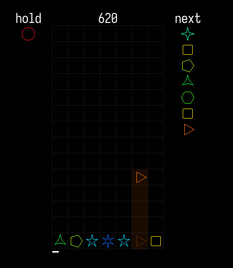

A useless "Fork" of ssuika (https://codeberg.org/nzuum/ssuika)

its a super useless fork but i wanted a version I could distribute to my other computers that has some tweaks (Like delaying the input sens and if i actually learn C after 100 years then there will be actual changes lmao

Prepare your eyes for horrible code as i literally dont know shit about C and raylib and so im just googling docs lowk

Requirements: Raylib, glfw, cmake, gmake (If on freebsd please use gmake as i havent made this for portability yet)

